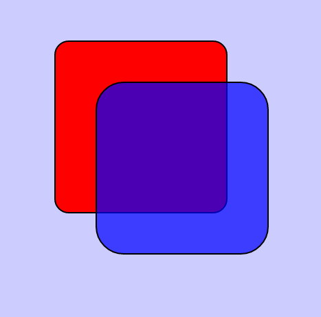

# `slipwayhq.svg`

A [Slipway](https://slipway.co/) Component which takes an SVG string and outputs the rendered SVG as
[a canvas](https://slipway.co/docs/guides/canvases).

This Component is used by Components such as [`slipwayhq.jsx`](https://github.com/slipwayhq/slipway_jsx)
and [`slipwayhq.echarts`](https://github.com/slipwayhq/slipway_echarts).

## Suggested Permissions

### `--allow-fonts`

This component may need to access fonts from the local system if it needs to render any text.

## Example Usage

Test the component by running the following command and pasting in the input when prompted:
```
slipway run-component "slipwayhq.svg.0.5.0" --allow-fonts
```

Input:
```json
{
  "width": 467,
  "height": 462,
  "background_color": "#ccccff",
  "svg": "<svg xmlns=\"http://www.w3.org/2000/svg\" width=\"467\" height=\"462\"><rect x=\"80\" y=\"60\" width=\"250\" height=\"250\" rx=\"20\" style=\"fill:#ff0000; stroke:#000000;stroke-width:2px;\" /><rect x=\"140\" y=\"120\" width=\"250\" height=\"250\" rx=\"40\" style=\"fill:#0000ff; stroke:#000000; stroke-width:2px; fill-opacity:0.7;\" /></svg>"
}
```

Output:
```json
{
  "canvas": {
    "width": 467,
    "height": 462,
    "data": "<encoded_rgba_bytes_omitted>"
  }
}
```

